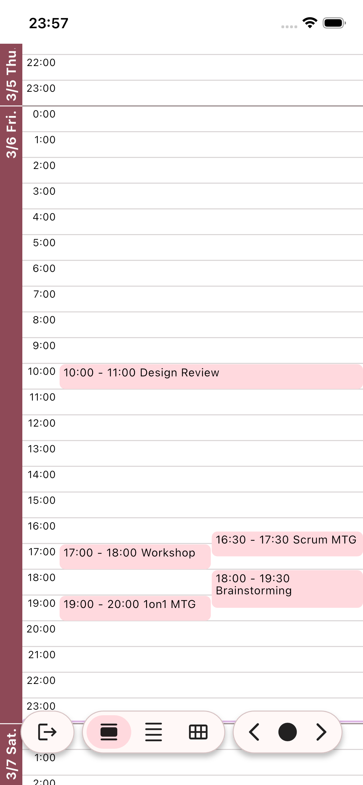
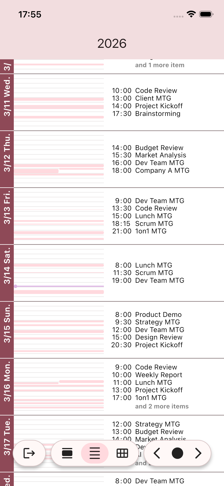
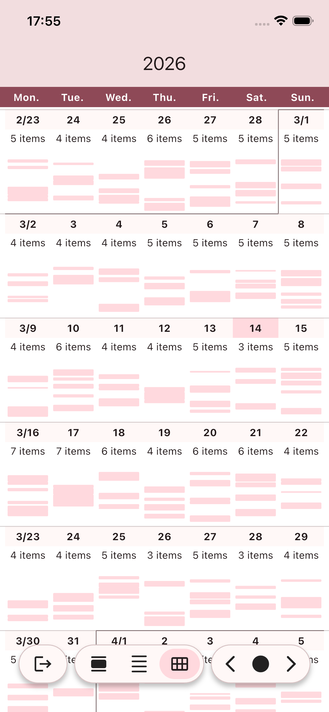

# B Scheduler

A custom Flutter scheduler widget with intuitive pinch-to-zoom gestures, seamless infinite scrolling, and multiple view modes (day, week, month). Features smooth timeline layouts and supports custom data sources including Google Calendar integration.


## Features

- **Multiple View Modes**: Switch between day, week, and month views
- **Intuitive Gestures**: Pinch-to-zoom for seamless transitions between view modes
- **Infinite Scrolling**: Smooth scrolling across all time ranges
- **Customizable Styling**: Full control over colors, fonts, and layout
- **Flexible Data Sources**: Callback-based architecture supports any data source
- **Real-time Updates**: Current time indicator automatically updates
- **Touch Events**: Tap handling for scheduler items

<table>
  <tr>
    <td></td>
    <td></td>
    <td></td>
  </tr>
  <tr>
    <td align="center">Day View</td>
    <td align="center">Week View</td>
    <td align="center">Month View</td>
  </tr>
</table>

## Getting Started

Add `b_scheduler` to your `pubspec.yaml`:

```yaml
dependencies:
  b_scheduler: ^0.0.3
```

Then run:

```bash
flutter pub get
```

## Usage

### Basic Implementation

```dart
import 'package:flutter/material.dart';
import 'package:b_scheduler/b_scheduler.dart';

class SchedulerScreen extends StatefulWidget {
  @override
  State<SchedulerScreen> createState() => _SchedulerScreenState();
}

class _SchedulerScreenState extends State<SchedulerScreen> {
  late final BSchedulerViewController controller;

  @override
  void initState() {
    super.initState();
    controller = BSchedulerViewController(
      onRangeChanged: (start, end) async {
        // Fetch items for the visible date range
        return await fetchItems(start, end);
      },
    );
  }

  @override
  void dispose() {
    controller.dispose();
    super.dispose();
  }

  @override
  Widget build(BuildContext context) {
    return Scaffold(
      body: BSchedulerView(
        controller: controller,
        onTapItem: (item) {
          print('Tapped: ${item.title}');
        },
      ),
    );
  }

  Future<List<BSchedulerItem>> fetchItems(DateTime start, DateTime end) async {
    // Return your scheduler items
    return [
      BSchedulerItem(
        title: "Meeting",
        startTime: DateTime.now().copyWith(hour: 10, minute: 0),
        endTime: DateTime.now().copyWith(hour: 11, minute: 0),
      ),
    ];
  }
}
```

### Customization

You can customize the scheduler's appearance using `BSchedulerStyle`:

```dart
BSchedulerView(
  controller: controller,
  style: BSchedulerStyle(
    primaryColor: Colors.blue,
    backgroundColor: Colors.white,
    gridLineColor: Colors.grey[300],
    // ... many more style options
  ),
)
```

### Controller Methods

The `BSchedulerViewController` provides several methods for programmatic control:

```dart
// Change view mode
controller.changeMode(BSchedulerMode.week);

// Navigate to specific date
controller.scrollToToday();
controller.scrollToNextScreen();
controller.scrollToPrevScreen();

// Listen to mode changes
controller.currentModeNotifier.addListener(() {
  print('Mode changed to: ${controller.currentModeNotifier.value}');
});
```

### Data Source Integration

The scheduler uses a callback-based approach for data loading, making it easy to integrate with any backend:

```dart
BSchedulerViewController(
  onRangeChanged: (start, end) async {
    // Fetch from REST API
    final response = await http.get('/api/events?start=$start&end=$end');
    return parseEvents(response);

    // Or fetch from local database
    return await database.getEvents(start, end);

    // Or integrate with Google Calendar
    return await googleCalendar.getEvents(start, end);
  },
)
```

## Example

A comprehensive example with Google Calendar integration is available in the [example](example/) directory. To run it:

```bash
cd example
flutter run
```

See [example/README.md](example/README.md) for detailed setup instructions.

## Additional Information

### Contributing

Contributions are welcome! Please feel free to submit a Pull Request.

### Issues

If you encounter any issues or have feature requests, please file them on [GitHub Issues](https://github.com/KazmaWed/b_scheduler/issues).

### License

This project is licensed under the MIT License - see the [LICENSE](LICENSE) file for details.
